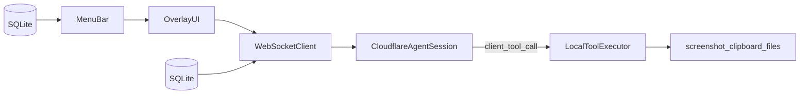

# CUA Companion

Mac menu-bar companion that connects your desktop to the Cloudflare Stateful Browser Agent. Run multi-session agent conversations from a floating overlay, trigger saved workflows with global hotkeys, and execute local tools (screenshot, clipboard, files) on behalf of the remote agent.

## Features

- **Menu bar agent** — persistent tray icon (no Dock icon) with quick access to the overlay, workflows, sessions, and settings
- **Overlay panel** — prompt/workflow runner, live agent trace timeline, run history, and session switcher
- **Multi-session conversations** — create, rename, switch, and delete agent sessions; trace state hydrates from the backend on reconnect
- **Saved workflows** — SQLite-backed prompt templates with optional global hotkeys and one-click run from the tray menu
- **Local tool bridge** — handles client-side tool calls from the agent: `getClipboardText`, `getClipboardImage`, `captureScreenshot`, `pickFile` (with user approval)

## Requirements

- macOS 12+
- Flutter 3.5+ (stable channel)
- Cloudflare `stateful-browser-agent` backend deployed and reachable

## Setup

```bash
flutter pub get
dart run build_runner build
```

Re-run `dart run build_runner build` after schema or model changes.

## Run

```bash
flutter run -d macos
```

The app runs as a menu-bar agent (no Dock icon). Use the tray icon to open the overlay, run workflows, or quit.

## Usage

1. Launch the app — a menu-bar icon appears (no Dock icon).
2. Open **Settings** from the tray menu → set **Agent host URL** and optional **Auth token** → **Save & reconnect**.
3. A session is auto-created on first run. Switch or create sessions from the overlay title bar or **Manage Sessions**.
4. Open **Overlay** → type a prompt or pick a workflow → **Run**.
5. Grant **Screen Recording** when using screenshot workflows (Settings shows permission status and a request button).

## Configuration

Open **Settings** from the tray menu:

- **Agent host URL** — your deployed Worker URL (default: `https://stateful-browser-agent.workers.dev`); remote hosts must use `https` (`http://localhost` is allowed for local dev)
- **Auth token** — stored in macOS Keychain; sent as `Authorization: Bearer` on WebSocket and HTTP requests; required for HTTP `/run` backends; optional for WebSocket session backends
- **Active session** — shown read-only with a copy button; managed via the Sessions UI, not typed manually
- **Default attach clipboard / screenshot** — opt-in defaults for the overlay prompt panel (both off by default)
- **Launch at login** — start the app automatically at login
- **Screen recording permission** — inline status with request or open System Settings

## Workflows

- Create, edit, and reorder workflows in **Manage Workflows**
- Assign global hotkeys (e.g. `Cmd+Shift+R`) — registered system-wide
- Seeded defaults on first launch:
  - Research this topic
  - Check GitHub notifications
  - Summarize latest PRs
- Workflows also appear in the tray menu for one-click run

## Quit

- Menu bar → **Quit CUA Companion**
- Overlay → `⋯` menu → **Quit** (or **Minimize to menu bar**)
- Settings → **Quit App**
- **Cmd+Q**

## Permissions

**Screen Recording** is required for the `captureScreenshot` local tool. The Settings page can request permission or open System Settings → Privacy & Security directly.

## Build release

```bash
flutter build macos --release
open build/macos/Build/Products/Release/cua_companion.app
```

## Architecture



- Flutter macOS app with Riverpod state management and drift (SQLite) persistence
- WebSocket client connects to `wss://{host}/agents/agent-session/{sessionId}` with RPC and state sync
- Agent defines client tools server-side; the companion executes them locally and returns results
- Workflows and sessions are stored locally; each session maps to a distinct agent conversation on the backend

See [docs/plan.md](docs/plan.md) for the full V1 implementation plan.
