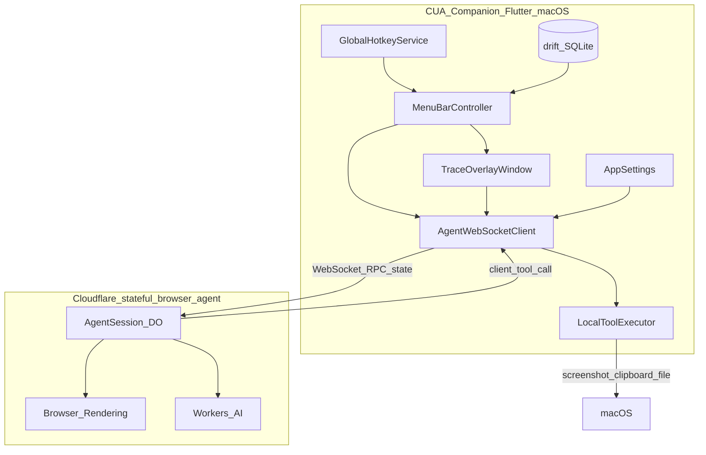
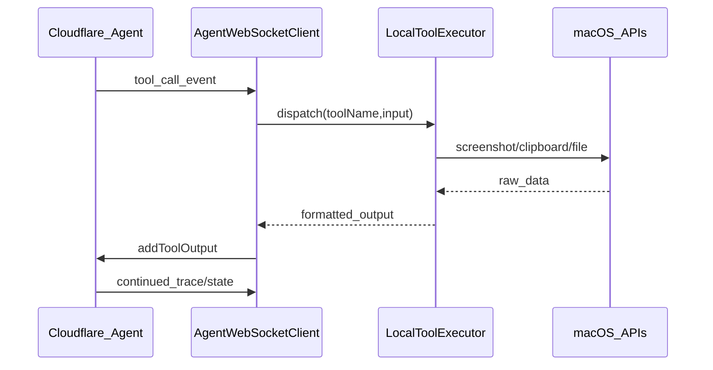

# CUA Companion — V1 Implementation Plan

## Context

Source spec: [Cua_COMPANION.docx](../Cua_COMPANION.docx)

| Requirement | V1 interpretation |
|---|---|
| Mac menu-bar / floating agent | Persistent menu-bar icon + detachable overlay panel |
| Local bridge to Cloudflare CUA | WebSocket client to Agents SDK endpoint |
| Screenshot / clipboard / file access | Native Mac services exposed as client-side tool handlers |
| Live agent trace overlay | Real-time stream of agent state, tool calls, and messages |
| Saved workflows + shortcuts | SQLite-backed prompts with global hotkey bindings |
| Quit app | Explicit exit from menu bar, overlay, and Cmd+Q — with clean shutdown |
| Tech stack | Flutter Desktop (macOS) + drift + hotkeys + screenshot + WebSocket |

**Scope boundary:** This plan covers **only** the Mac companion in `claudeflare-cua-companion`. The backend in [`../claudeflare-event`](../claudeflare-event) is assumed to expose a standard Agents SDK contract.

**Assumed backend contract** (from Agents SDK + existing scaffold):

- WebSocket URL: `wss://{host}/agents/agent-session/{sessionId}`
- RPC: `{ type: "rpc", id, method, args }` / response with `success`, `result`, `done`
- State sync: `{ type: "cf_agent_state", state }` (bidirectional)
- Chat/tool events: streamed via agent state or dedicated RPC methods (e.g. `sendMessage`, `addToolOutput`)
- CORS enabled on Worker (`routeAgentRequest(..., { cors: true })`)
- Client tools defined server-side without `execute`; companion handles tool calls locally and returns results

---

## Architecture



### Layering

| Layer | Responsibility |
|---|---|
| `lib/core/` | App bootstrap, config, logging, permissions |
| `lib/data/` | drift DB, settings store, DTOs for agent protocol |
| `lib/services/agent/` | WebSocket client, reconnection, RPC, state sync |
| `lib/services/local/` | Screenshot, clipboard, file picker, hotkeys |
| `lib/features/` | UI features: menu bar, overlay, workflows, settings |
| `lib/shared/` | Theme, widgets, models |

---

## Phase 1 — Project Scaffold & macOS Shell

### 1.1 Initialize Flutter macOS desktop app

```bash
flutter create --platforms=macos cua_companion
```

Target: **macOS only** for V1 (doc specifies Mac menu-bar agent).

### 1.2 Core dependencies

| Package | Purpose |
|---|---|
| `window_manager` | Frameless overlay, always-on-top, position persistence |
| `tray_manager` | Menu-bar icon + context menu |
| `hotkey_manager` | Global keyboard shortcuts |
| `screen_capturer` | Full-screen / region screenshots |
| `super_clipboard` | Read/write clipboard (text + images) |
| `file_picker` | Local file selection |
| `drift` + `sqlite3_flutter_libs` | Workflows + settings persistence |
| `web_socket_channel` | Agent WebSocket transport |
| `riverpod` + `flutter_riverpod` | State management |
| `freezed` + `json_serializable` | Immutable models / protocol DTOs |
| `uuid` | RPC correlation IDs |
| `path_provider` | App support directory |
| `permission_handler` (macOS) | Screen recording permission prompts |

### 1.3 macOS entitlements & Info.plist

Required for V1 local tools:

- **Screen Recording** — screenshot capture
- **App Sandbox** — enable with user-selected file read (file picker) and network client
- **LSUIElement** (`Application is agent (UIElement)`) — hide Dock icon, menu-bar-only feel
- **NSAppleEventsUsageDescription** — if future automation is needed (not V1)

Files:

- `macos/Runner/DebugProfile.entitlements`
- `macos/Runner/Release.entitlements`
- `macos/Runner/Info.plist`

### 1.4 App entry & window model

Two windows:

1. **Hidden / minimal main window** — hosts Riverpod + services; not shown in Dock
2. **Overlay panel** — floating trace + prompt UI; toggled from menu bar or hotkey

`lib/main.dart` responsibilities:

- Init `window_manager`, `tray_manager`, `hotkey_manager`
- Register background services
- Show overlay on demand (not at launch)

### 1.5 App lifecycle & quit

`lib/core/app_lifecycle_service.dart` — central `quitApp()` used by all exit paths:

1. Cancel any in-flight agent run (`agentSessionService.cancelRun()`)
2. Close WebSocket connection gracefully
3. Unregister all global hotkeys
4. Destroy menu-bar tray icon
5. Close overlay and hidden windows
6. Flush drift DB / pending writes
7. Call `exit(0)` (or `SystemNavigator.pop()` on macOS)

**Quit entry points (all route to `quitApp()`):**

| Location | Trigger |
|---|---|
| Menu bar tray menu | **Quit CUA Companion** (bottom item, separated by divider) |
| Overlay window | **Quit** button in title-bar menu (or `⋯` menu) |
| Settings screen | **Quit App** button at bottom |
| macOS standard | **Cmd+Q** global shortcut (registered even when overlay is hidden) |

Closing the overlay window alone does **not** quit the app — the menu-bar agent keeps running until the user explicitly chooses Quit.

---

## Phase 2 — Agent WebSocket Client

Implement a Dart port of `AgentClient` behavior (no React SDK on Flutter).

### 2.1 Protocol models

`lib/data/models/agent_protocol.dart`:

```dart
// Inbound/outbound message types
sealed class AgentMessage { ... }
class RpcRequest { String id; String method; List<dynamic> args; }
class RpcResponse { String id; bool success; dynamic result; String? error; bool? done; }
class StateSyncMessage { Map<String, dynamic> state; }
class ToolCallEvent { String toolCallId; String toolName; Map<String, dynamic> input; }
```

### 2.2 WebSocket service

`lib/services/agent/agent_websocket_client.dart`:

- Connect to `wss://{host}/agents/agent-session/{sessionId}`
- Exponential backoff reconnection (mirror Agents SDK client)
- `call(method, args)` → pending RPC map keyed by `id`
- `setState(partial)` → push `cf_agent_state`
- `onStateUpdate` stream for overlay
- `onToolCall` stream for local tool dispatch
- `onTraceEvent` stream (derived from state: messages, tool runs, status)

### 2.3 Session & settings

`lib/data/models/app_settings.dart`:

- `agentHost` (default: dev Worker URL)
- `sessionId` (stable per Mac install, UUID)
- `authToken` (optional query param for future backend auth)
- Overlay position/size, theme preference

Persist via drift `settings` table.

### 2.4 Chat / task dispatch API

Thin facade `lib/services/agent/agent_session_service.dart`:

| Method | Backend call (assumed) |
|---|---|
| `runWorkflow(prompt, context)` | `call("sendMessage", [prompt, context])` or `call("runTask", [payload])` |
| `submitToolResult(toolCallId, output)` | `call("addToolOutput", [{ toolCallId, output }])` |
| `cancelRun()` | `call("cancel", [])` |
| `getState()` | latest synced state |

Exact method names should be confirmed when backend lands; wrap behind this facade so only one file changes.

---

## Phase 3 — Local Mac Tool Executor

`lib/services/local/local_tool_executor.dart`

Handle server-initiated client tool calls:

| Tool name | Local action | Output shape |
|---|---|---|
| `getClipboardText` | Read pasteboard text | `{ text: string }` |
| `getClipboardImage` | Read image if present | `{ base64: string, mime: string }` |
| `captureScreenshot` | Full screen or region | `{ base64: string, width, height }` |
| `pickFile` | macOS file picker | `{ path, name, mime, base64? }` |
| `readFile` | Read user-approved path | `{ content, mime }` |

Flow:



Permission UX: on first screenshot attempt, prompt for Screen Recording; show inline overlay banner if denied.

---

## Phase 4 — Workflows & Global Shortcuts

### 4.1 drift schema

`lib/data/database/app_database.dart`

**`workflows` table:**

| Column | Type | Notes |
|---|---|---|
| `id` | TEXT PK | UUID |
| `name` | TEXT | Display name |
| `prompt_template` | TEXT | Supports `{{clipboard}}`, `{{selection}}` placeholders |
| `icon` | TEXT | SF Symbol name or emoji |
| `sort_order` | INT | Menu ordering |
| `attach_screenshot` | BOOL | Auto-attach screenshot on run |
| `attach_clipboard` | BOOL | Auto-attach clipboard on run |
| `created_at` / `updated_at` | DATETIME | |

**`workflow_shortcuts` table:**

| Column | Type |
|---|---|
| `workflow_id` | FK |
| `hotkey` | TEXT (serialized: `cmd+shift+1`) |

**`run_history` table** (for overlay history tab):

| Column | Type |
|---|---|
| `id`, `workflow_id`, `status`, `started_at`, `completed_at`, `summary` |

### 4.2 Workflow service

`lib/services/workflows/workflow_service.dart`:

- CRUD workflows
- Resolve template placeholders before dispatch
- Bind/unbind global hotkeys via `hotkey_manager`
- On hotkey: build context payload → `agentSessionService.runWorkflow()`

### 4.3 Seed default workflows (V1)

Ship 3 built-in examples matching the doc:

1. **Research this topic** — uses clipboard text
2. **Check GitHub notifications** — fixed prompt
3. **Summarize latest PRs** — fixed prompt + optional screenshot

---

## Phase 5 — UI (V1 Product Quality)

Design direction: compact macOS-native feel — translucent overlay, monospace trace log, clear status chips. Dark mode default.

### 5.1 Menu bar

`lib/features/menu_bar/menu_bar_controller.dart`

Tray icon states: idle / running / error / disconnected.

Menu items:

- Workflows list (click to run)
- Open overlay
- Settings
- — (divider)
- **Quit CUA Companion** → calls `AppLifecycleService.quitApp()`

### 5.2 Overlay window (primary UI)

`lib/features/overlay/overlay_window.dart`

**Layout — 3 columns on wide, stacked on narrow:**

1. **Prompt panel** — quick-run text field, workflow picker, attach toggles (screenshot/clipboard/file)
2. **Live trace panel** — scrolling timeline:
   - User prompt submitted
   - Agent thinking / tool calls (server browser tools)
   - Client tool requests (screenshot, clipboard) with completion status
   - Final response
3. **History sidebar** — recent runs from `run_history`

Controls: Run, Cancel, Clear, Pin (always-on-top), Minimize to menu bar, **Quit** (in window `⋯` menu).

Closing the overlay (X button) hides the panel only; use **Quit** or **Cmd+Q** to exit the app entirely.

Connection badge: `Connected` / `Reconnecting` / `Offline` with host indicator.

### 5.3 Workflows manager

`lib/features/workflows/workflow_editor_page.dart`

- List workflows (reorder drag-and-drop)
- Create / edit / delete
- Prompt template editor with placeholder hints
- Hotkey recorder widget (capture key combo, conflict detection)

### 5.4 Settings

`lib/features/settings/settings_page.dart`

- Agent host URL
- Session ID (regenerate)
- Auth token (secure field)
- Default attach behavior
- Overlay opacity / font size
- Launch at login (macOS `LaunchAtLogin` via `launch_at_startup`)
- Permissions status + "Open System Settings" links
- **Quit App** button (red/destructive style) at bottom of settings

---

## Phase 6 — Reliability & Polish

### 6.1 Connection lifecycle

- Auto-connect on launch (background)
- Queue workflow runs while reconnecting (max 1 pending)
- Surface last error in overlay + menu bar icon

### 6.2 Trace persistence

- Append trace events to `run_history` incrementally
- Allow re-opening a past run in overlay (read-only)

### 6.3 Error handling

| Failure | UX |
|---|---|
| WebSocket disconnect | Auto-reconnect + banner |
| RPC timeout (60s) | Cancel button + retry |
| Screenshot permission denied | Inline fix instructions |
| Tool call unsupported | Log + return structured error to agent |

### 6.4 Packaging

- `flutter build macos --release`
- Optional: sign + notarize for distribution
- `README.md` with setup, permissions, and backend URL config

---

## Proposed File Tree

```
claudeflare-cua-companion/
├── Cua_COMPANION.docx
├── docs/
│   └── plan.md
├── README.md
├── pubspec.yaml
├── lib/
│   ├── main.dart
│   ├── app.dart
│   ├── core/
│   │   ├── config.dart
│   │   ├── app_lifecycle_service.dart
│   │   ├── permissions.dart
│   │   └── logging.dart
│   ├── data/
│   │   ├── database/
│   │   │   ├── app_database.dart
│   │   │   └── tables.dart
│   │   └── models/
│   │       ├── agent_protocol.dart
│   │       ├── app_settings.dart
│   │       ├── trace_event.dart
│   │       └── workflow.dart
│   ├── services/
│   │   ├── agent/
│   │   │   ├── agent_websocket_client.dart
│   │   │   └── agent_session_service.dart
│   │   ├── local/
│   │   │   ├── local_tool_executor.dart
│   │   │   ├── screenshot_service.dart
│   │   │   ├── clipboard_service.dart
│   │   │   └── file_service.dart
│   │   └── workflows/
│   │       └── workflow_service.dart
│   ├── features/
│   │   ├── menu_bar/
│   │   ├── overlay/
│   │   ├── workflows/
│   │   └── settings/
│   └── shared/
│       ├── theme.dart
│       └── widgets/
└── macos/
    └── Runner/  (entitlements, Info.plist, Assets.xcassets tray icon)
```

---

## Implementation Order

| Step | Deliverable | Depends on |
|---|---|---|
| 1 | Flutter macOS app + menu-bar shell + overlay window | — |
| 2 | Settings persistence (drift) + config screen | 1 |
| 3 | Agent WebSocket client with reconnect + state sync | 2 |
| 4 | Local tool executor (clipboard → screenshot → file) | 3 |
| 5 | Workflow CRUD + hotkey bindings | 2 |
| 6 | End-to-end run: hotkey → workflow → agent → trace overlay | 3, 4, 5 |
| 7 | History, error states, permissions UX, polish | 6 |
| 8 | README + release build | 7 |

### Implementation checklist

- [ ] Initialize Flutter macOS project with menu-bar shell, overlay window, `AppLifecycleService.quitApp()`, and core dependencies
- [ ] Implement `AgentWebSocketClient` (RPC, state sync, reconnect) and `AgentSessionService` facade
- [ ] Build `LocalToolExecutor` for clipboard, screenshot, and file tools with macOS permission handling
- [ ] Add drift schema and `WorkflowService` with CRUD, template placeholders, and global hotkey bindings
- [ ] Build overlay UI: prompt panel, live trace timeline, connection status, run/cancel controls
- [ ] Build workflow editor and settings screens (host URL, session, permissions, launch at login)
- [ ] Wire end-to-end flow, run history, error states, README, and release macOS build

---

## Backend Integration Checklist (external dependency)

When [`../claudeflare-event`](../claudeflare-event) is ready, confirm:

- [ ] `routeAgentRequest` wired with `cors: true`
- [ ] `AgentSession extends AIChatAgent` (or `Agent`) with `sendMessage` / `addToolOutput` callable methods
- [ ] Client tools declared without `execute`: `getClipboardText`, `captureScreenshot`, `pickFile`, `readFile`
- [ ] Agent state includes trace-friendly fields: `status`, `messages`, `activeToolCalls`
- [ ] Deployed URL added to companion Settings default

---

## Risks & Mitigations

| Risk | Mitigation |
|---|---|
| Agents SDK has no official Flutter/Dart client | Implement thin protocol client; isolate behind `AgentSessionService` |
| Callable method names may change with backend | Single facade file; no raw RPC calls in UI |
| macOS Screen Recording permission friction | First-run guided setup in Settings |
| Global hotkey conflicts | Conflict detection in shortcut recorder |
| Large screenshot payloads over WebSocket | Compress JPEG + size cap (e.g. 1920px max edge) |

---

## V1 Done Criteria

- Menu-bar app runs persistently with no Dock icon
- User can quit the app from menu bar, overlay, settings, or Cmd+Q; shutdown cleans up connections, hotkeys, and tray
- User can create/edit/delete workflows with global hotkeys
- One-click or hotkey run sends prompt + optional local context to Cloudflare agent
- Agent client tool calls (clipboard, screenshot, file) execute locally and return results
- Overlay shows live trace through run completion
- Settings configure backend URL, session, and permissions
- Run history viewable after completion
- Release macOS build succeeds
